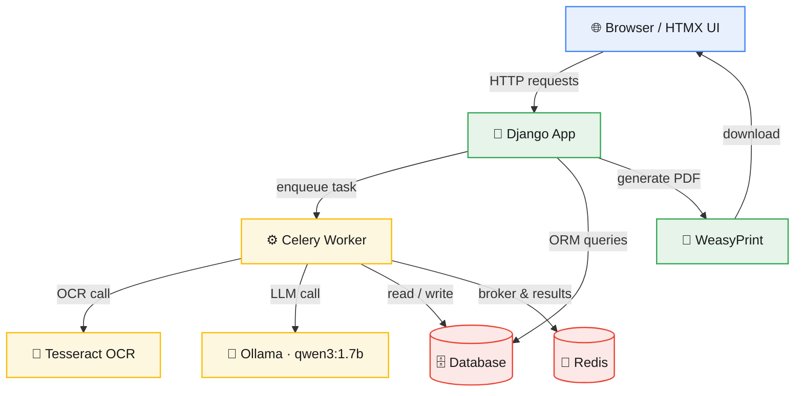

# SmartForm — AI-Powered Form Automation & Validation (v2.0)

> 📘 Full project documentation: [workflow.md](workflow.md)
> 🔗 **GitHub Repository:** [github.com/Spectre206/smartform](https://github.com/Spectre206/smartform)

A web application that automates the completion of structured forms by extracting data from uploaded document images using **Tesseract OCR**, auto-filling forms, and providing an **AI assistant** (powered by a local LLM via Ollama) that validates entries, answers questions, and detects errors. Built with Django, HTMX, Celery, Redis, and Python — no JavaScript required.


---

## Overview

**SmartForm** is a standalone form automation system — no external APIs are connected. It demonstrates how AI and OCR can simplify filling structured forms.

1. **Upload** a clean, machine-printed document image (e.g., a mock CNIC).
2. **Extract** name, father's name, ID number, date of birth, address, and city using Tesseract OCR.
3. **Auto-fill** the application form.
4. **Chat** with an AI assistant that explains fields, checks for missing data, and highlights errors.
5. **Download** a ready-to-submit PDF.

Processing runs **asynchronously** in the background using Celery + Redis, so the user interface stays responsive.

---

## What's New in v2.0

- **Asynchronous processing** — OCR and validation now run in background tasks (Celery + Redis).
- **Automatic status flow** — upload → extracted → validated, without manual clicks.
- **Live status polling** — HTMX updates the status badge every 2 seconds and auto-refreshes the page when validation completes.
- **Extended OCR fields** — now extracts address and city, not just name and CNIC.
- **Improved extraction reliability** — line-based bounding boxes, punctuation cleanup, and Django form validation fallback.
- **Gemini removed** — Tesseract is the sole OCR engine for now.
- **UI polish** — landing page updated to reflect the async workflow and its limitations.

---

## Tech Stack

| Component      | Technology                                                     |
|-----------------|------------------------------------------------------------------|
| Backend         | Django 6.0 + Django REST Framework (optional)                   |
| Database        | SQLite (dev) / PostgreSQL (prod)                                 |
| Frontend        | Django Templates + Bootstrap 5 + HTMX                            |
| AI Assistant    | Ollama running `qwen3:1.7b` (local, CPU-only)                    |
| OCR Engine      | Tesseract via `pytesseract`, image preprocessing with OpenCV     |
| Async Tasks     | Celery 5.6 + Redis 7                                             |
| PDF Generation  | WeasyPrint                                                       |
| Environment     | pipenv                                                            |

---

## System Architecture



> **Note:** OCR and LLM calls run **asynchronously** inside Celery tasks, so the web request never blocks. Redis serves as both the message broker and the result backend.

---

## Features (v2.0)

- **Landing page** — public-facing hero, feature cards, and CTA.
- **User authentication** — sign up, log in, dashboard with application history.
- **ID card OCR** — extracts personal information from a clean document image using Tesseract (works best on mock CNIC — see limitations).
- **Auto-fill form** — data from OCR automatically populates the application.
- **AI assistant (chat)** — interactive chat widget (HTMX) that explains fields, checks for errors, and highlights issues.
- **Automatic validation** — after extraction, a background task runs AI validation and sets status to `validated` if no errors are found.
- **Live status tracking** — badge updates every 2 seconds; the page auto-refreshes when status changes to `validated`.
- **PDF generation** — produces a filled, official-looking application form for download.
- **Delete application** — remove applications directly from the dashboard.
- **Consistent UI** — forest-green header/footer, centered forms, Bootstrap 5 styling.

---

## Current Limitations (v2.0)

- **OCR accuracy** — Tesseract works best on clean, machine-printed mock images. Real-world ID cards with complex backgrounds may not extract perfectly. Use the provided mock CNIC generator for reliable demos.
- **AI assistant is basic** — the assistant can answer simple questions and validate fields, but it isn't yet deeply integrated into every step of the workflow. Planned for v3.
- **No multiple form types** — only the CNIC correction form is supported. Expanding to other forms is planned for later.
- **Single-machine setup** — the Celery worker must be run separately; there's no Docker Compose yet.

---

## Future Roadmap (Portfolio v3)

- **Enhanced AI assistant** — more context-aware, persistent error storage, better guidance.
- **Vision-language model for OCR** — replace Tesseract with a local vision model (e.g., `minicpm-v` via Ollama) for robust, context-aware extraction from real ID cards.
- **REST API** — build a DRF API for mobile or third-party integration.
- **Containerization** — Docker Compose for easy deployment of Django, Celery, Redis, and Ollama.
- **Comprehensive integration tests** covering the full asynchronous pipeline.

---

## Project Structure

```
smartform/
├── manage.py
├── Pipfile
├── system_prompt.txt
├── config/                  # Django project settings
├── applications/            # Core app: form model, views, tasks
│   ├── templatetags/        # Custom template filters (add_class)
│   └── tests/                # Test package (test_auth, test_forms, test_pdf, test_views, test_tasks)
├── assistant/                 # AI chat assistant
│   └── tests/                 # Test package (test_views)
├── ocr_engine/                 # Tesseract pipeline
│   └── tests/                  # Test package (test_views, test_extractor)
├── templates/                  # Global templates & partials
├── static/                     # CSS
├── media/                      # Uploaded images & generated PDFs
└── README.md
```

---

## Getting Started

### Prerequisites

- **Python 3.12+** (tested on Ubuntu 24.04)
- **Tesseract OCR** installed system-wide
- **Redis** installed and running
- **Ollama** installed with the model pulled (`qwen3:1.7b`)
- **pipenv** for virtual environments

### System Dependencies (Ubuntu)

```bash
sudo apt update
sudo apt install tesseract-ocr tesseract-ocr-eng libgl1 libgtk-3-0t64 \
                 libpango-1.0-0 libcairo2 libgdk-pixbuf2.0-0 \
                 libffi-dev libssl-dev python3-dev redis-server -y
```

### Install Ollama & Pull the Model

```bash
curl -fsSL https://ollama.com/install.sh | sh
ollama pull qwen3:1.7b
```

### Clone & Set Up the Environment

```bash
git clone https://github.com/Spectre206/smartform.git
cd smartform
pipenv install
```

### Apply Migrations & Create a Superuser

```bash
pipenv run python3 manage.py migrate
pipenv run python3 manage.py createsuperuser
```

### Run Services (3 terminals)

```bash
# Terminal 1: Redis
redis-server

# Terminal 2: Celery worker
pipenv run celery -A config worker -l info

# Terminal 3: Django development server
pipenv run python3 manage.py runserver
```

Visit **http://localhost:8000**

---

## License

MIT — maintained by [Spectre206](https://github.com/Spectre206) as a portfolio project.