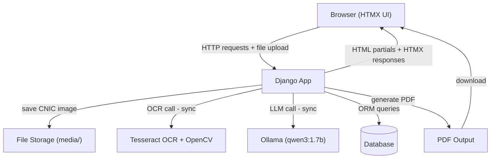

# SmartForm — AI-Powered Form Automation & Validation (v1.6)

> 📘 Full project documentation: [workflow.md](workflow.md)
> 🔗 **GitHub Repository:** [https://github.com/Spectre206/smartform](https://github.com/Spectre206/smartform)

A web application that automates the completion of **structured forms** (starting with CNIC correction) by extracting data from uploaded ID cards using **Tesseract OCR**, auto-filling forms, and providing an **AI assistant** (powered by a local LLM via Ollama) that validates entries, answers questions, and detects errors. Built entirely with Django, HTMX, and Python — no JavaScript required.


---

## Overview

**SmartForm** is a **standalone form automation system** – no external APIs are connected. It demonstrates how AI and OCR can simplify filling structured forms.

1. **Upload** a photo of an ID card (e.g., CNIC).
2. **Extract** name, father's name, ID number, and date of birth using a custom OCR pipeline (Tesseract + OpenCV).
3. **Auto-fill** the application form.
4. **Chat** with an AI assistant that explains fields, checks for missing data, and highlights errors.
5. **Download** a ready-to-submit PDF.

Everything runs locally — no cloud services, no JavaScript frameworks.

---

## What's New in v1.6

- **Delete Application** – users can now delete their applications from the dashboard with a confirmation dialog.
- **Improved OCR extraction** – the Tesseract pipeline now uses line‑level bounding‑box data to extract multi‑word values correctly (e.g., "Ali Khan" instead of just "Ali").
- **Status preservation** – saving an application no longer resets its status to "Draft". The status now flows logically: `Draft → Extracted → Validated → PDF Ready`.
- **Enhanced test coverage** – added tests for delete functionality, OCR extractor, and validation views. Total: 18 passing tests.
- **Cleaner repository** – stale remote branches removed; local branches reduced to `main` and `develop`.

---

## Tech Stack

| Component      | Technology                                                   |
|-----------------|----------------------------------------------------------------|
| Backend         | Django 6.0 + Django REST Framework (optional)                 |
| Database        | SQLite (dev) / PostgreSQL (prod)                               |
| Frontend        | Django Templates + Bootstrap 5 + HTMX                          |
| AI Assistant    | Ollama running `qwen3:1.7b` (local, CPU-only)                 |
| OCR Engine      | Tesseract via `pytesseract`, image preprocessing with OpenCV   |
| PDF Generation  | WeasyPrint                                                     |
| Environment     | pipenv                                                         |

---

## System Architecture



> ⚠️ **Current (v1.6)**: All components run **synchronously** inside the Django request‑response cycle. OCR and LLM calls block the user interface for a few seconds.
> **Planned for v2**: Replace synchronous calls with **Celery + Redis** background tasks for a fully asynchronous experience.

---

## Features (v1.6)

- **Landing page** – public‑facing hero, feature cards, and CTA.
- **User Authentication** – sign up, log in, dashboard with application history.
- **ID Card OCR** – extract personal information from CNIC images using a custom Tesseract pipeline (bounding‑box based, works well on clean mock images).
- **Auto-fill Form** – data from OCR automatically populates the application.
- **AI Assistant (Chat)** – interactive chat widget (HTMX) that:
  - Explains form fields & required documents.
  - Checks the form for errors and missing data.
  - Highlights specific fields with error messages.
- **Real-time Validation** – inline field validation powered by Django forms + HTMX.
- **PDF Generation** – generates a filled, official‑looking application form for download.
- **Status Tracking** – visual progress: `Draft → Extracted → Validated → PDF Ready`.
  - After uploading an ID, status automatically becomes `Extracted`.
  - A **Validate** button runs the AI assistant; if no errors, status becomes `Validated`.
  - Generating a PDF sets status to `PDF Ready`.
- **Delete Application** – remove applications directly from the dashboard.
- **Consistent UI** – forest‑green header/footer, centered forms, Bootstrap 5 styling.

---

## Current Limitations (v1.6)

- **OCR Accuracy:** The Tesseract pipeline works best on clean, machine‑printed mock images. Real‑world ID cards with complex backgrounds may not extract perfectly.
- **Synchronous Processing:** OCR and AI assistant calls run inside the request/response cycle, making the UI wait (up to a few seconds). Background workers are planned for v2.
- **Small AI Model:** The assistant uses `qwen3:1.7b`. It is fast but may occasionally produce incomplete answers. A larger model would improve quality.
- **Manual Trigger for Validation:** The user must click "Validate" to check the form. In v2, validation will be automatic.

---

## Future Roadmap (Portfolio v2 & v3)

### v2 (Next Phase)
- **Asynchronous Processing** – integrate **Celery + Redis** so OCR and AI validation run in the background, making the UI responsive.
- **Primary Data Extraction with Gemini API** – use Gemini (free tier) for primary extraction from uploaded ID images, with **Tesseract as secondary verification** on more complex mock CNICs.
- **Fully Automatic Status Flow** – the status will progress automatically without user intervention (e.g., after upload, background task sets `Extracted`; after validation, sets `Validated`).
- **No Multiple Forms Yet** – focus on perfecting the single CNIC workflow before expanding.

### v3 (Advanced)
- Replace Tesseract with a **vision‑language model** (e.g., `minicpm-v` via Ollama) for robust, context‑aware extraction.
- Build a **REST API** (DRF) for mobile or third‑party integration.
- Containerize with **Docker Compose** and deploy to a cloud VM.
- Add **comprehensive integration tests** covering the full asynchronous pipeline.

---

## Project Structure

```
smartform/
├── manage.py
├── Pipfile
├── system_prompt.txt
├── config/                  # Django project settings
├── applications/            # Core app: form model, views, dashboards
│   ├── templatetags/        # Custom template filters (add_class)
│   └── tests/               # Test package (test_auth, test_forms, test_pdf, test_views)
├── assistant/                # AI chat assistant
│   └── tests/                # Test package (test_views)
├── ocr_engine/                # Tesseract pipeline
│   └── tests/                 # Test package (test_views, test_extractor)
├── templates/                 # Global templates & partials
├── static/                    # CSS
├── media/                     # Uploaded images & generated PDFs
└── README.md
```

---

## Getting Started

### Prerequisites

- **Python 3.12+** (tested on Ubuntu 24.04)
- **Tesseract OCR** installed system-wide
- **Ollama** installed and model pulled (`qwen3:1.7b`)
- **pipenv** for virtual environments

### System Dependencies (Ubuntu)

```bash
sudo apt update
sudo apt install tesseract-ocr tesseract-ocr-eng libgl1 libgtk-3-0t64 \
                 libpango-1.0-0 libcairo2 libgdk-pixbuf2.0-0 \
                 libffi-dev libssl-dev python3-dev -y
```

### Install Ollama & Pull Model

```bash
curl -fsSL https://ollama.com/install.sh | sh
ollama pull qwen3:1.7b
```

### Clone & Setup Environment

```bash
git clone https://github.com/Spectre206/smartform.git
cd smartform
pipenv install
```

### Apply Migrations & Create Superuser

```bash
pipenv run python3 manage.py migrate
pipenv run python3 manage.py createsuperuser
```

### Run Development Server

```bash
pipenv run python3 manage.py runserver
```

Visit **http://localhost:8000**

---

## License

MIT