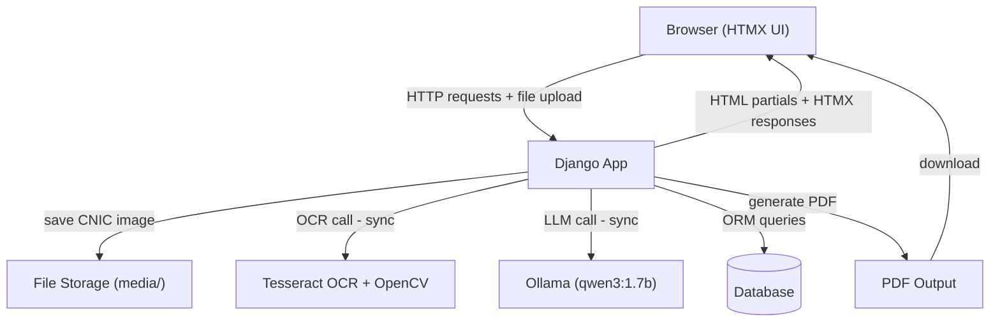

# SmartForm — AI-Powered Form Automation & Validation (v1)

> 📘 Full project documentation: [workflow.md](workflow.md)

A web application that automates the completion of government forms (CNIC correction/renewal) by extracting data from uploaded ID cards using **Tesseract OCR**, auto-filling forms, and providing an **AI assistant** (powered by a local LLM via Ollama) that validates entries, answers questions, and detects errors. Built entirely with Django, HTMX, and Python — no JavaScript required.


---

## Overview

**SmartForm** is a **simulated** government form automation system. No real NADRA or government APIs are connected. It demonstrates how AI and OCR can simplify form filling.

1. **Upload** a photo of your CNIC (National ID card).
2. **Extract** name, father's name, CNIC number, and date of birth using custom OCR (Tesseract + OpenCV).
3. **Auto-fill** the application form.
4. **Chat** with an AI assistant that explains fields, checks for missing data, and highlights errors.
5. **Download** a ready-to-submit PDF.

Everything runs locally — no cloud services, no JavaScript frameworks.

---

## Tech Stack

| Component      | Technology                                       |
|-----------------|---------------------------------------------------|
| Backend         | Django 6.0 + Django REST Framework (optional)     |
| Database        | SQLite (dev) / PostgreSQL (prod)                  |
| Frontend        | Django Templates + Bootstrap 5 + HTMX             |
| AI Assistant    | Ollama running `qwen3:1.7b` (local, CPU-only)     |
| OCR Engine      | Tesseract via `pytesseract`, image preprocessing with OpenCV |
| PDF Generation  | WeasyPrint                                         |
| Environment     | pipenv                                             |

---

## System Architecture



> ⚠️ All components run **synchronously** inside the Django request‑response cycle. OCR and LLM calls block the user interface for a few seconds. Background workers (Celery) are planned for v2.

---

## Features (v1)

- **User Authentication** — sign up, log in, dashboard with application history.
- **ID Card OCR** — extract personal information from CNIC images using a custom Tesseract pipeline (works best on clean, machine-printed mock images – see limitations).
- **Auto-fill Form** — data from OCR automatically populates the application.
- **AI Assistant (Chat)** — interactive chat widget (HTMX) that:
  - Explains form fields & required documents.
  - Checks the form for errors and missing data.
  - Highlights specific fields with error messages.
- **Real-time Validation** — inline field validation powered by Django forms + HTMX.
- **PDF Generation** — generates a filled, official-looking application form for download.
- **Status Tracking** — visual progress: `Draft → Extracted → Validated → PDF Ready` (currently advanced manually via admin or direct link).

---

## Current Limitations (honest for v1)

- **OCR Accuracy:** The Tesseract pipeline uses simple rules and does not always extract data correctly from real CNIC photos. For demos, use the provided mock CNIC generator.
- **Synchronous Processing:** OCR and AI assistant calls run inside the request/response cycle, making the UI wait (up to a few seconds). Background workers (Celery) are planned for v2.
- **Small AI Model:** The assistant uses `qwen3:1.7b`. It is fast but may occasionally produce incomplete answers. A larger model would improve quality.
- **Manual Status Flow:** The form status must be changed manually (via admin) to `validated` before a PDF can be generated. A proper automatic validation workflow will be added later.

---

## Future Roadmap (Portfolio v2 & v3)

This project is the first of three progressively complex versions:

**v2 (Medium Complexity)**
- Replace synchronous calls with **Celery + RabbitMQ** for background OCR and AI processing.
- Add **multiple government forms** (domicile, vehicle registration, etc.).
- Improve OCR with better image preprocessing and layout analysis.
- Implement proper **status workflow** with automatic validation.

**v3 (Advanced)**
- Swap Tesseract for a **vision‑language model** (e.g., `minicpm-v` via Ollama) for robust, context‑aware extraction.
- Build a **REST API** (DRF) for mobile or third‑party integration.
- Containerize with **Docker Compose** and deploy to a cloud VM.
- Add **comprehensive unit & integration tests** covering the full pipeline.

---

## Project Structure

```
smartform/
├── manage.py
├── Pipfile
├── system_prompt.txt
├── config/                  # Django project settings
├── applications/            # Core app: form model, views, dashboards
├── assistant/               # AI chat assistant
├── ocr_engine/              # Tesseract pipeline
├── templates/               # Global templates & partials
├── static/                  # CSS
├── media/                   # Uploaded images & generated PDFs
└── README.md
```

---

## Getting Started

### Prerequisites

- **Python 3.12+** (tested on Ubuntu 24.04)
- **Tesseract OCR** installed system-wide
- **Ollama** installed and model pulled (`qwen3:1.7b`)
- **pipenv** for virtual environments

### System Dependencies (Ubuntu)

```bash
sudo apt update
sudo apt install tesseract-ocr tesseract-ocr-eng libgl1 libgtk-3-0t64 \
                 libpango-1.0-0 libcairo2 libgdk-pixbuf2.0-0 \
                 libffi-dev libssl-dev python3-dev -y
```

### Install Ollama & Pull Model

```bash
curl -fsSL https://ollama.com/install.sh | sh
ollama pull qwen3:1.7b
```

### Clone & Setup Environment

```bash
git clone <your-repo-url> smartform
cd smartform
pipenv install
```

### Apply Migrations & Create Superuser

```bash
pipenv run python3 manage.py migrate
pipenv run python3 manage.py createsuperuser
```

### Run Development Server

```bash
pipenv run python3 manage.py runserver
```

Visit **http://localhost:8000**

---

## License

MIT