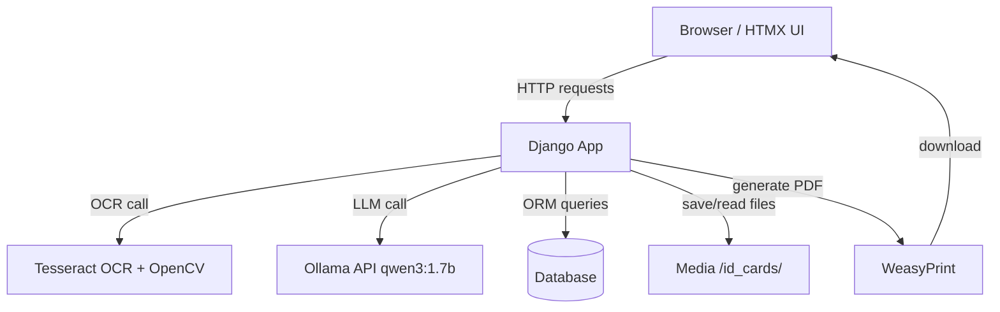
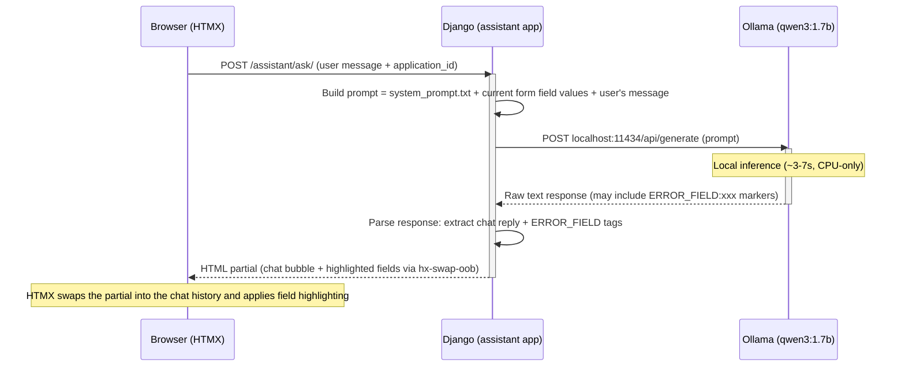

# 🧾 SmartForm — Project & Workflow Guide (v1.5)

> **Purpose:** A complete reference for the SmartForm project — architecture, tech stack, branching strategy, development workflow, and troubleshooting.
> **Goal:** Any developer (or AI assistant) should be able to read this document and immediately know how to work on the project.

---

## 📑 Table of Contents

1. [Project Overview](#1-project-overview)
2. [Tech Stack & Rationale](#2-tech-stack--rationale)
3. [System Architecture](#3-system-architecture)
4. [LLM Call Lifecycle (Single Request)](#4-llm-call-lifecycle-single-request)
5. [Project Directory Structure](#5-project-directory-structure)
6. [Setup Instructions](#6-setup-instructions)
7. [Branching Strategy](#7-branching-strategy)
8. [Development Workflow](#8-development-workflow)
9. [Key Design Decisions](#9-key-design-decisions)
10. [Roadmap (v1.5)](#10-roadmap-v15-features--build-order)
11. [Troubleshooting & Common Pitfalls](#11-troubleshooting--common-pitfalls)
12. [Future Upgrades](#12-future-upgrades-portfolio-v2-v3)

---

## 1. Project Overview

**SmartForm** is an AI-powered government form automation and validation system *(portfolio v1.5)*.

It simulates a **CNIC Correction/Renewal** form workflow:

1. A citizen uploads a photo of their national ID card.
2. Data is extracted via **Tesseract OCR**.
3. The form is auto-filled.
4. A local **AI assistant (LLM)** validates the form and answers questions.
5. A completed **PDF** is generated for download.

Built entirely with **Django, HTMX, and Python** — no JavaScript frameworks required.

---

## 2. Tech Stack & Rationale

| Component      | Technology                          | Why                                                             |
|-----------------|--------------------------------------|-------------------------------------------------------------------|
| Backend         | Django 6.x                           | Full-stack framework, great for forms, templates, ORM             |
| Database        | SQLite (dev)                         | Simple to start with; can switch to PostgreSQL later              |
| Frontend        | Django Templates, Bootstrap 5, HTMX  | Dynamic UI without writing JavaScript                              |
| AI Assistant    | Ollama `qwen3:1.7b`                  | Lightweight (~1.2 GB), runs on CPU, good instruction-following     |
| OCR Engine      | Tesseract + OpenCV preprocessing     | Free, offline, no GPU required                                     |
| PDF Generation  | WeasyPrint                            | Converts HTML/CSS to PDF in pure Python                            |
| Environment     | pipenv                                | Reproducible builds; virtualenv kept inside project (`.venv/`)    |
| Async           | None (synchronous)                    | All calls happen in-request; acceptable for a demo                |

---

## 3. System Architecture

### High-Level Data Flow



### Component Breakdown

The `Django App` node above is composed of three internal apps:

| App              | Responsibility                                  |
|-------------------|--------------------------------------------------|
| `applications`   | Form model, dashboard, views                     |
| `assistant`      | Chat endpoint, prompt builder                     |
| `ocr_engine`     | Image preprocessing & extraction pipeline         |

> **Note:** All external calls (Tesseract, Ollama, database, storage, WeasyPrint) are made **synchronously, directly from Django views** — there are no background workers in v1.5.

**Typical latency per request:**
- Tesseract OCR: ~2–5s
- Ollama LLM API (`localhost:11434`): ~3–7s

---

## 4. LLM Call Lifecycle (Single Request)

This section zooms into the one part of the request cycle that isn't a simple I/O call: what actually happens between the browser and Ollama when a user sends a chat message.



### What's happening at each step (and why it matters for you)

1. **Browser → Django** — HTMX posts the user's chat message to `/assistant/ask/`. This is a normal form POST, no JavaScript fetch logic needed.
2. **Prompt building (`assistant` app)** — Django doesn't just forward the raw message to the model. It assembles a full prompt out of three parts:
   - `system_prompt.txt` — the persona/instructions that tell the model how to behave and how to format validation output.
   - The **current form state** — the field values already extracted/entered, so the model has context to actually validate, not just chat blindly.
   - The **user's message** itself.
3. **Django → Ollama** — a synchronous HTTP POST to `localhost:11434/api/generate`. The Django worker thread blocks here for the full duration of inference (~3-7s on CPU). Nothing else happens in that request until Ollama replies.
4. **The `ERROR_FIELD` trick** — this is the key design idea worth understanding. `qwen3:1.7b` is a small local model, so instead of forcing it to return structured JSON (which small models are often unreliable at), the system prompt instructs it to embed simple markers like `ERROR_FIELD:cnic_number` inside its normal plain-text reply. Django then parses the response with a lightweight text scan: the human-readable part becomes the chat bubble, and any `ERROR_FIELD` markers become instructions to Django to flag that specific field in the UI via HTMX out-of-band swaps. One model output, two consumers — the person reading it and Django's parser.
5. **Django → Browser** — Django returns an HTML partial (not JSON), and HTMX swaps the chat message into the chat history and, if there were errors, highlights the corresponding fields. No database changes are made; the highlighting is purely visual and ephemeral.

### Why this is synchronous (and when that becomes a problem)

Because there's no task queue in v1.5, the Django worker handling this request is fully blocked for the entire 3-7s inference window. For a single user testing locally, this is invisible. Under concurrent load, though, every simultaneous chat message ties up a worker for several seconds — this is exactly why [Future Upgrades](#12-future-upgrades-portfolio-v2-v3) calls for Celery + RabbitMQ in v2: it lets the LLM call run in the background and the browser poll or get pushed the result, instead of holding the HTTP connection open the whole time.

---

## 5. Project Directory Structure

```
smartform/
├── config/                     # Django project settings
├── applications/               # Core app (model, forms, views)
│   ├── templatetags/           # Custom template filters (add_class)
│   └── tests/                  # Test package (test_auth, test_forms, test_pdf)
├── assistant/                  # AI chat (views, prompts)
│   └── tests/                  # Test package (test_views)
├── ocr_engine/                 # OCR extraction (extractor.py, preprocessing.py)
│   └── tests/                  # Test package (test_views)
├── templates/                  # Global templates (base.html, landing.html, partials)
├── static/css/                 # Custom styles
├── media/id_cards/             # Uploaded CNIC images
├── system_prompt.txt           # System prompt for the LLM
├── workflow.md                 # This file
└── README.md                   # Project overview
```

---

## 6. Setup Instructions

Run these steps after cloning the repository.

**1. System dependencies (Ubuntu)**
```bash
sudo apt install tesseract-ocr tesseract-ocr-eng libgl1 libgtk-3-0t64 \
                 libpango-1.0-0 libcairo2 libgdk-pixbuf2.0-0 \
                 libffi-dev libssl-dev python3-dev
```

**2. Python environment**
```bash
pipenv install
```

**3. Pull the AI model**
```bash
ollama pull qwen3:1.7b
```

**4. Database**
```bash
pipenv run python3 manage.py migrate
pipenv run python3 manage.py createsuperuser   # optional
```

**5. Run the server**
```bash
pipenv run python3 manage.py runserver
```

---

## 7. Branching Strategy

*(Simplified Git Flow)*

| Branch               | Purpose                                      |
|-----------------------|-----------------------------------------------|
| `main`                | Stable, deployable code                       |
| `develop`             | Integration branch where features are merged  |
| `feature/<feature-name>` | Each new feature/module, branched from `develop` |

### Rules
- 🚫 Never commit directly to `main` or `develop`.
- ✅ Create a feature branch from `develop`, work, then open a PR back into `develop`.
- ✅ When `develop` is stable, merge it into `main` and tag a release.

### Examples
- `feature/user-auth`
- `feature/ocr-pipeline`
- `feature/chat-assistant`
- `feature/pdf-generation`
- `feature/reorganized-ui` (v1.5)

---

## 8. Development Workflow

1. Pick a feature from the [roadmap](#10-roadmap-v15-features--build-order).
2. Create a branch: `git checkout -b feature/<name> develop`
3. Implement the feature, committing often.
4. Push the branch and open a pull request into `develop`.
5. Address review feedback, then merge.

---

## 9. Key Design Decisions

- **Synchronous OCR & LLM calls** — Keeps the architecture simple for v1.5. Later versions will add Celery + RabbitMQ.
- **HTMX over JavaScript** — The developer has no frontend experience; HTMX provides interactivity using pure HTML.
- **Tesseract instead of a vision LLM** — Lightweight, no GPU needed; custom preprocessing improves accuracy on ID cards.
- **`qwen3:1.7b`** — Minimal RAM footprint (~2–3 GB), yet capable enough for structured validation and chat.
- **Models registered in Django admin** — Allows easy inspection of data during development.
- **Assistant does not persist validation errors** — In v1.5, chat validation errors are displayed inline via HTMX out-of-band swaps but do not modify the database. This keeps the assistant stateless and avoids accidental overwrites.
- **Custom template filter (`add_class`)** — Applies Bootstrap `form-control` class to all form fields cleanly, without repeating code.
- **Per-app test packages** — Tests are split into `applications/tests/`, `assistant/tests/`, `ocr_engine/tests/` for modularity and ease of maintenance.

---

## 10. Roadmap (v1.5 features – build order)

- [x] Project scaffold, dependencies, branching, and this document
- [x] User authentication (Django built-in login/logout/signup)
- [x] Dashboard (list user applications)
- [x] Application form (manual entry)
- [x] OCR extraction pipeline → auto-fill form
- [x] AI assistant chat (HTMX)
- [x] Assistant-based validation (`ERROR_FIELD` parsing)
- [x] Final submission & status tracking (statuses visible, manually advanced)
- [x] PDF generation (WeasyPrint)
- [x] **UI overhaul & landing page** — forest-green theme, centered forms, responsive design, landing page with hero/features
- [x] **Test reorganization** — split monolithic tests.py into per-app test packages
- [x] **Template filter** — `add_class` for Bootstrap styling
- [ ] Dockerize application (future)
- [ ] Automatic status workflow (v2)

---

## 11. Troubleshooting & Common Pitfalls

| Issue                                          | Solution                                                                                   |
|-------------------------------------------------|-----------------------------------------------------------------------------------------------|
| `tesseract: command not found`                 | Install Tesseract system-wide: `sudo apt install tesseract-ocr`                              |
| OpenCV `libGL.so.1` missing                    | Install `libgl1` (Ubuntu 24.04 uses `libgl1`, not `libgl1-mesa-glx`)                          |
| Ollama connection refused                       | Ensure the service is running: `systemctl status ollama`                                     |
| Model runs out of RAM                           | Use a smaller quantized model or reduce `num_predict`                                        |
| HTMX not triggering                             | Check that the CDN script is loaded in `base.html` and the endpoint returns HTML, not a redirect |
| Migrations fail                                 | Delete `db.sqlite3` and the `migrations/` folders inside apps (except `__init__.py`), then re-run `makemigrations` and `migrate` |
| Virtualenv created in wrong location (Snap VS Code) | Run `pipenv install` inside the project directory to create a local `.venv`               |

---

## 12. Future Upgrades (portfolio v2, v3)

- **v2:** Celery + RabbitMQ for background tasks; support for multiple form types; improved OCR with layout analysis; automatic status progression.
- **v3:** Vision LLM for OCR (e.g., `minicpm-v`), REST API, container orchestration, comprehensive test coverage.