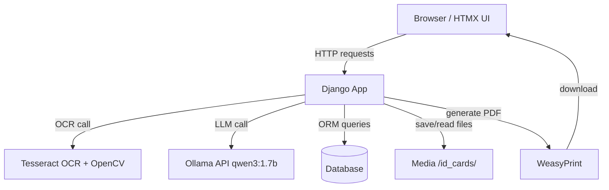

# 🧾 SmartForm — Project & Workflow Guide

> **Purpose:** A complete reference for the SmartForm project — architecture, tech stack, branching strategy, development workflow, and troubleshooting.
> **Goal:** Any developer (or AI assistant) should be able to read this document and immediately know how to work on the project.

---

## 📑 Table of Contents

1. [Project Overview](#1-project-overview)
2. [Tech Stack & Rationale](#2-tech-stack--rationale)
3. [System Architecture](#3-system-architecture)
4. [Project Directory Structure](#4-project-directory-structure)
5. [Setup Instructions](#5-setup-instructions)
6. [Branching Strategy](#6-branching-strategy)
7. [Development Workflow](#7-development-workflow)
8. [Key Design Decisions](#8-key-design-decisions)
9. [Roadmap (v1)](#9-roadmap-v1-features--build-order)
10. [Troubleshooting & Common Pitfalls](#10-troubleshooting--common-pitfalls)
11. [Future Upgrades](#11-future-upgrades-portfolio-v2-v3)

---

## 1. Project Overview

**SmartForm** is an AI-powered government form automation and validation system *(portfolio v1)*.

It simulates a **CNIC Correction/Renewal** form workflow:

1. A citizen uploads a photo of their national ID card.
2. Data is extracted via **Tesseract OCR**.
3. The form is auto-filled.
4. A local **AI assistant (LLM)** validates the form and answers questions.
5. A completed **PDF** is generated for download.

Built entirely with **Django, HTMX, and Python** — no JavaScript frameworks required.

---

## 2. Tech Stack & Rationale

| Component      | Technology                          | Why                                                  |
|-----------------|--------------------------------------|-------------------------------------------------------|
| Backend         | Django 4.x / 6.x                     | Full-stack framework, great for forms, templates, ORM |
| Database        | SQLite (dev)                         | Simple to start with; can switch to PostgreSQL later  |
| Frontend        | Django Templates, Bootstrap 5, HTMX  | Dynamic UI without writing JavaScript                 |
| AI Assistant    | Ollama `qwen3:1.7b`                   | Lightweight (~1.2 GB), runs on CPU, good instruction-following |
| OCR Engine      | Tesseract + OpenCV preprocessing     | Free, offline, no GPU required                        |
| PDF Generation  | WeasyPrint                            | Converts HTML/CSS to PDF in pure Python               |
| Environment     | pipenv                                | Reproducible builds; virtualenv kept inside project (`.venv/`) |
| Async           | None (synchronous)                    | All calls happen in-request; acceptable for a demo    |

---

## 3. System Architecture

### High-Level Data Flow



### Component Breakdown

The `Django App` node above is composed of three internal apps:

| App              | Responsibility                                  |
|-------------------|--------------------------------------------------|
| `applications`   | Form model, dashboard, views                     |
| `assistant`      | Chat endpoint, prompt builder                     |
| `ocr_engine`     | Image preprocessing & extraction pipeline         |

> **Note:** All external calls (Tesseract, Ollama, database, storage, WeasyPrint) are made **synchronously, directly from Django views** — there are no background workers in v1.

**Typical latency per request:**
- Tesseract OCR: ~2–5s
- Ollama LLM API (`localhost:11434`): ~3–7s

---

## 4. Project Directory Structure

```
smartform/
├── config/                 # Django project settings
├── applications/           # Core app (model, forms, views)
├── assistant/              # AI chat (views, prompts)
├── ocr_engine/             # OCR extraction (extractor.py, preprocessing.py)
├── templates/              # Global templates (base.html, partials)
├── static/css/             # Custom styles
├── media/id_cards/         # Uploaded CNIC images
├── system_prompt.txt       # System prompt for the LLM
├── workflow.md             # This file
└── README.md               # Project overview
```

---

## 5. Setup Instructions

Run these steps after cloning the repository.

**1. System dependencies (Ubuntu)**
```bash
sudo apt install tesseract-ocr tesseract-ocr-eng libgl1 libgtk-3-0t64 \
                 libpango-1.0-0 libcairo2 libgdk-pixbuf2.0-0 \
                 libffi-dev libssl-dev python3-dev
```

**2. Python environment**
```bash
pipenv install
```

**3. Pull the AI model**
```bash
ollama pull qwen3:1.7b
```

**4. Database**
```bash
pipenv run python3 manage.py migrate
pipenv run python3 manage.py createsuperuser   # optional
```

**5. Run the server**
```bash
pipenv run python3 manage.py runserver
```

---

## 6. Branching Strategy

*(Simplified Git Flow)*

| Branch               | Purpose                                      |
|-----------------------|-----------------------------------------------|
| `main`                | Stable, deployable code                       |
| `develop`             | Integration branch where features are merged  |
| `feature/<feature-name>` | Each new feature/module, branched from `develop` |

### Rules
- 🚫 Never commit directly to `main` or `develop`.
- ✅ Create a feature branch from `develop`, work, then open a PR back into `develop`.
- ✅ When `develop` is stable, merge it into `main` and tag a release.

### Examples
- `feature/user-auth`
- `feature/ocr-pipeline`
- `feature/chat-assistant`
- `feature/pdf-generation`

---

## 7. Development Workflow

1. Pick a feature from the [roadmap](#9-roadmap-v1-features--build-order).
2. Create a branch: `git checkout -b feature/<name> develop`
3. Implement the feature, committing often.
4. Push the branch and open a pull request into `develop`.
5. Address review feedback, then merge.

---

## 8. Key Design Decisions

- **Synchronous OCR & LLM calls** — Keeps the architecture simple for v1. Later versions will add Celery + RabbitMQ.
- **HTMX over JavaScript** — The developer has no frontend experience; HTMX provides interactivity using pure HTML.
- **Tesseract instead of a vision LLM** — Lightweight, no GPU needed; custom preprocessing improves accuracy on ID cards.
- **`qwen3:1.7b`** — Minimal RAM footprint (~2–3 GB), yet capable enough for structured validation and chat.
- **Models registered in Django admin** — Allows easy inspection of data during development.

---

## 9. Roadmap (v1 features – build order)

- [x] Project scaffold, dependencies, branching, and this document
- [ ] User authentication (Django built-in login/logout/signup)
- [ ] Dashboard (list user applications)
- [ ] Application form (manual entry)
- [ ] OCR extraction pipeline → auto-fill form
- [ ] AI assistant chat (HTMX)
- [ ] Assistant-based validation (`ERROR_FIELD` parsing)
- [ ] Final submission & status tracking
- [ ] PDF generation (WeasyPrint)
- [ ] Polish & Docker

---

## 10. Troubleshooting & Common Pitfalls

| Issue                                          | Solution                                                                                   |
|-------------------------------------------------|-----------------------------------------------------------------------------------------------|
| `tesseract: command not found`                 | Install Tesseract system-wide: `sudo apt install tesseract-ocr`                              |
| OpenCV `libGL.so.1` missing                    | Install `libgl1` (Ubuntu 24.04 uses `libgl1`, not `libgl1-mesa-glx`)                          |
| Ollama connection refused                       | Ensure the service is running: `systemctl status ollama`                                     |
| Model runs out of RAM                           | Use a smaller quantized model or reduce `num_predict`                                        |
| HTMX not triggering                             | Check that the CDN script is loaded in `base.html` and the endpoint returns HTML, not a redirect |
| Migrations fail                                 | Delete `db.sqlite3` and the `migrations/` folders inside apps (except `__init__.py`), then re-run `makemigrations` and `migrate` |
| Virtualenv created in wrong location (Snap VS Code) | Run `pipenv install` inside the project directory to create a local `.venv`               |

---

## 11. Future Upgrades (portfolio v2, v3)

- **v2:** Celery + RabbitMQ for background tasks; support for multiple form types
- **v3:** Vision LLM for OCR (e.g., `minicpm-v`), REST API, container orchestration

---