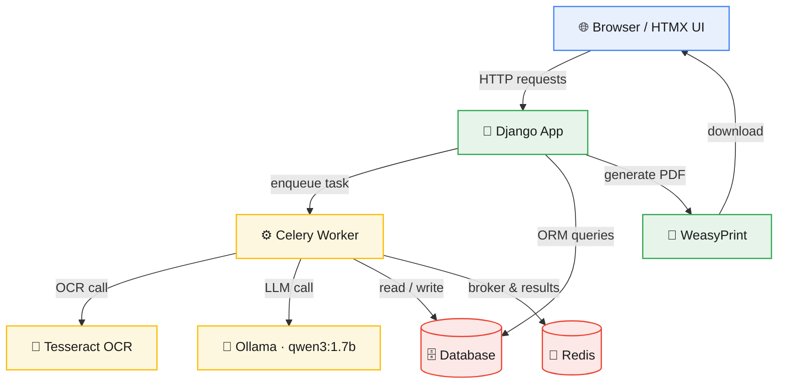
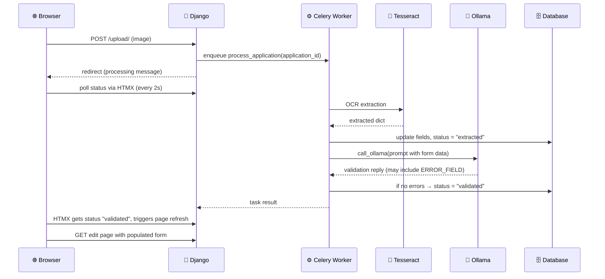

# 🧾 SmartForm — Project & Workflow Guide (v2.0)

> **Purpose:** A complete reference for the SmartForm project — architecture, tech stack, branching strategy, development workflow, and troubleshooting.
> **Goal:** Any developer (or AI assistant) should be able to read this document and immediately know how to work on the project.

---

## 📑 Table of Contents

1. [Project Overview](#1-project-overview)
2. [Tech Stack & Rationale](#2-tech-stack--rationale)
3. [System Architecture](#3-system-architecture)
4. [Async Task Lifecycle (OCR + Validation)](#4-async-task-lifecycle-ocr--validation)
5. [Project Directory Structure](#5-project-directory-structure)
6. [Setup Instructions](#6-setup-instructions)
7. [Branching Strategy](#7-branching-strategy)
8. [Development Workflow](#8-development-workflow)
9. [Key Design Decisions](#9-key-design-decisions)
10. [Roadmap (v2.0 Features & Build Order)](#10-roadmap-v20-features--build-order)
11. [Troubleshooting & Common Pitfalls](#11-troubleshooting--common-pitfalls)
12. [Future Upgrades (Portfolio v3)](#12-future-upgrades-portfolio-v3)

---

## 1. Project Overview

**SmartForm** is an AI-powered form automation and validation system *(portfolio v2.0)*.

It currently focuses on a **CNIC Correction/Renewal** workflow, but is designed to be extended later.

1. A user uploads a clean, machine-printed document image (mock CNIC recommended).
2. Data is extracted asynchronously using **Tesseract OCR**.
3. The form is auto-filled.
4. A background task runs **AI validation**.
5. If valid, a completed **PDF** can be generated.

Built with **Django, HTMX, Celery, Redis, and Python** — no JavaScript frameworks.

---

## 2. Tech Stack & Rationale

| Component      | Technology                          | Why                                                              |
|-----------------|--------------------------------------|---------------------------------------------------------------------|
| Backend         | Django 6.x                           | Full-stack framework, great for forms, templates, ORM               |
| Database        | SQLite (dev)                         | Simple to start with; can switch to PostgreSQL later                |
| Frontend        | Django Templates, Bootstrap 5, HTMX  | Dynamic UI without writing JavaScript                                |
| AI Assistant    | Ollama `qwen3:1.7b`                  | Lightweight (~1.2 GB), runs on CPU, good instruction-following       |
| OCR Engine      | Tesseract + OpenCV preprocessing     | Free, offline, no GPU required                                       |
| Async Tasks     | Celery 5.6 + Redis 7                 | Background processing for OCR, LLM, and PDF generation              |
| PDF Generation  | WeasyPrint                            | Converts HTML/CSS to PDF in pure Python                              |
| Environment     | pipenv                                | Reproducible builds; virtualenv inside project (`.venv/`)           |

---

## 3. System Architecture

### High-Level Data Flow (v2.0 — Asynchronous)



### Component Breakdown

| App              | Responsibility                                   |
|-------------------|----------------------------------------------------|
| `applications`    | Form model, dashboard, views, tasks                |
| `assistant`       | Chat endpoint, prompt builder, `call_ollama`       |
| `ocr_engine`      | Tesseract extraction and preprocessing             |

> **Note:** All heavy lifting (OCR, LLM validation) happens in Celery tasks. Django views stay lightweight and return quickly.

---

## 4. Async Task Lifecycle (OCR + Validation)

This section describes the background task that runs after a user uploads an image.



### Key Points

- The view does **not** block; it enqueues the task and returns immediately.
- HTMX polling keeps the user informed without a manual refresh.
- When status becomes `validated`, the response includes `HX-Refresh: true` to reload the page automatically.

---

## 5. Project Directory Structure

```
smartform/
├── config/                     # Django settings, celery app
├── applications/                # Core app
│   ├── tasks.py                 # Celery task for extraction/validation
│   ├── templatetags/            # Custom filters
│   └── tests/                    # Test package
├── assistant/                    # AI chat assistant
│   └── tests/                     # Test package
├── ocr_engine/                    # OCR extraction
│   └── tests/                      # Test package
├── templates/                      # Global templates, partials
├── static/css/                     # Custom styles
├── media/id_cards/                 # Uploaded images
├── system_prompt.txt               # System prompt for LLM
├── workflow.md                     # This file
└── README.md
```

---

## 6. Setup Instructions

Run these steps after cloning the repository.

**1. System dependencies (Ubuntu)**
```bash
sudo apt install tesseract-ocr tesseract-ocr-eng libgl1 libgtk-3-0t64 \
                 libpango-1.0-0 libcairo2 libgdk-pixbuf2.0-0 \
                 libffi-dev libssl-dev python3-dev redis-server
```

**2. Python environment**
```bash
pipenv install
```

**3. Pull the AI model**
```bash
ollama pull qwen3:1.7b
```

**4. Database**
```bash
pipenv run python3 manage.py migrate
pipenv run python3 manage.py createsuperuser
```

**5. Run services (3 terminals)**
```bash
# Terminal 1
redis-server

# Terminal 2
pipenv run celery -A config worker -l info

# Terminal 3
pipenv run python3 manage.py runserver
```

---

## 7. Branching Strategy

*(Simplified Git Flow)*

| Branch                    | Purpose                                            |
|----------------------------|-------------------------------------------------------|
| `main`                     | Stable, deployable code                              |
| `develop`                  | Integration branch where features are merged         |
| `feature/<feature-name>`   | Each new feature/module, branched from `develop`     |

### Rules

- 🚫 Never commit directly to `main` or `develop`.
- ✅ Create a feature branch from `develop`, work, then open a PR back into `develop`.
- ✅ When `develop` is stable, merge it into `main` and tag a release.

### Examples

- `feature/user-auth`
- `feature/ocr-pipeline`
- `feature/chat-assistant`
- `feature/auto-status-flow` (v2)

---

## 8. Development Workflow

1. Pick a feature from the [roadmap](#10-roadmap-v20-features--build-order).
2. Create a branch: `git checkout -b feature/<name> develop`
3. Implement the feature, committing often.
4. Push the branch and open a pull request into `develop`.
5. Address review feedback, then merge.

---

## 9. Key Design Decisions

- **Asynchronous processing** — Celery + Redis prevent blocking the web worker during OCR/LLM calls.
- **Tesseract only** — Gemini was tested but removed for simplicity; can be re-added later.
- **Django validation fallback** — if the LLM returns an empty response, the app still validates using Django forms to avoid false positives.
- **HTMX polling** — a lightweight way to update status without a frontend framework.
- **Per-app test packages** — clean separation of tests.
- **Custom template filter** — `add_class` for Bootstrap form styling.
- **Transparency about OCR limits** — the README and landing page clearly state that mock images work best.

---

## 10. Roadmap (v2.0 Features & Build Order)

- [x] Project scaffold, dependencies, branching
- [x] User authentication
- [x] Dashboard & application CRUD
- [x] Application form with manual entry
- [x] OCR extraction pipeline (Tesseract)
- [x] AI assistant chat (HTMX)
- [x] Assistant validation (`ERROR_FIELD` parsing)
- [x] PDF generation
- [x] UI overhaul & landing page
- [x] Test reorganization
- [x] Delete application
- [x] **Async processing (Celery + Redis)**
- [x] **Automatic status flow** (upload → extracted → validated)
- [x] **Extended OCR fields** (address, city)
- [x] **Gemini removed** (Tesseract only)
- [ ] Dockerize application (v3)
- [ ] Vision LLM for OCR (v3)

---

## 11. Troubleshooting & Common Pitfalls

| Issue                                        | Solution                                                                                     |
|------------------------------------------------|--------------------------------------------------------------------------------------------------|
| `tesseract: command not found`                 | Install Tesseract system-wide: `sudo apt install tesseract-ocr`                                 |
| OpenCV `libGL.so.1` missing                    | Install `libgl1` (Ubuntu 24.04 uses `libgl1`)                                                    |
| Ollama connection refused                       | Ensure the service is running: `systemctl status ollama`                                        |
| Celery worker not picking up tasks              | Check Redis is running (`redis-cli ping` → `PONG`), then restart the Celery worker              |
| Status badge doesn't update                     | Verify `partials/status_badge.html` exists and `application_status` returns HTML, not JSON      |
| Page doesn't auto-refresh on validated          | Ensure `application_status` sets `response['HX-Refresh'] = 'true'` when status changes          |
| OCR returns empty or wrong data                 | Use the mock CNIC generator (`generate_mock_cnic.py`) and ensure the image is clear              |
| Virtualenv in the wrong location (Snap VS Code) | Run `pipenv install` inside the project directory to create a local `.venv`                     |

---

*Maintained by [Spectre206](https://github.com/Spectre206) — Portfolio Project*